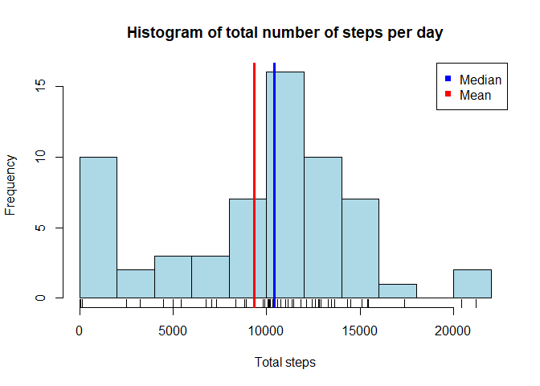

## Loading and preprocessing the data

```r
wd <- "."
setwd(wd)
data_path <- file.path(wd, "data")
file_path <- file.path(data_path, "activity.csv")

df <- read.csv(file_path, header = TRUE, na.strings = "NA")
df$date <- as.Date(df$date, "%Y-%m-%d")
str(df)
```

```
## 'data.frame':	17568 obs. of  3 variables:
##  $ steps   : int  NA NA NA NA NA NA NA NA NA NA ...
##  $ date    : Date, format: "2012-10-01" "2012-10-01" ...
##  $ interval: int  0 5 10 15 20 25 30 35 40 45 ...
```

## What is mean total number of steps taken per day?


```r
total_steps <- tapply(df$steps, df$date, sum, na.rm = TRUE)
hist(total_steps, breaks = 10, col = "lightblue", xlab = "Total steps",
     main = "Histogram of total number of steps per day")
rug(total_steps)
abline(v = mean(total_steps), col = "red", lwd = 3)
abline(v = median(total_steps), col = "blue", lwd = 3)
legend("topright", pch = 15, col = c("blue", "red"), 
       legend = c("Median", "Mean"))
```

<!-- -->

## What is the average daily activity pattern?


## Imputing missing values


## Are there differences in activity patterns between weekdays and weekends?
