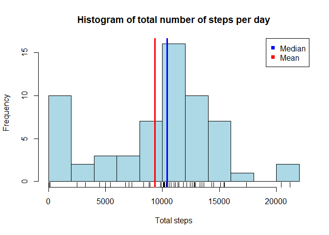
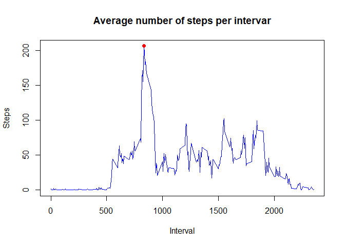
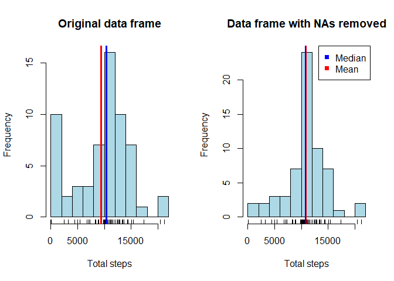
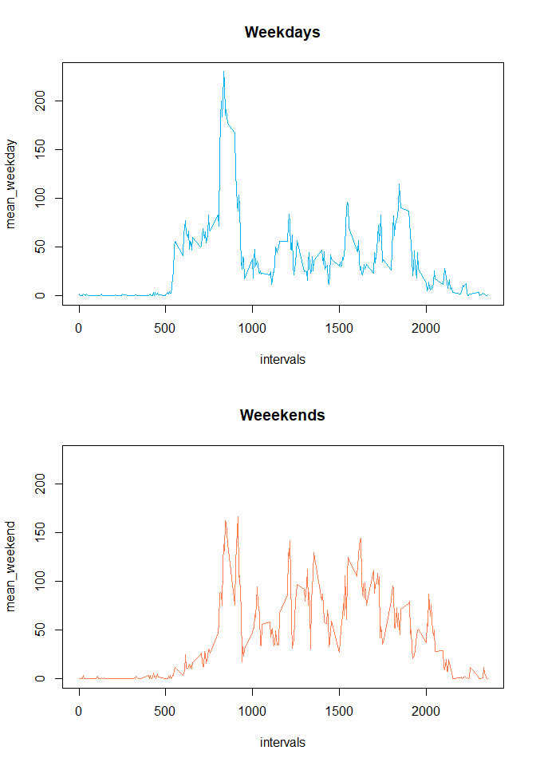

## Loading and preprocessing the data

```r
wd <- "."
setwd(wd)
data_path <- file.path(wd, "data")
file_path <- file.path(data_path, "activity.csv")

df <- read.csv(file_path, header = TRUE, na.strings = "NA")
df$date <- as.Date(df$date, "%Y-%m-%d")
str(df)
```

```
## 'data.frame':	17568 obs. of  3 variables:
##  $ steps   : int  NA NA NA NA NA NA NA NA NA NA ...
##  $ date    : Date, format: "2012-10-01" "2012-10-01" ...
##  $ interval: int  0 5 10 15 20 25 30 35 40 45 ...
```

## What is mean total number of steps taken per day?


```r
total_steps <- tapply(df$steps, df$date, sum, na.rm = TRUE)
hist(total_steps, breaks = 10, col = "lightblue", xlab = "Total steps",
     main = "Histogram of total number of steps per day")
rug(total_steps)
abline(v = mean(total_steps), col = "red", lwd = 3)
abline(v = median(total_steps), col = "blue", lwd = 3)
legend("topright", pch = 15, col = c("blue", "red"), 
       legend = c("Median", "Mean"))
```



## What is the average daily activity pattern?

```r
mean_steps <- tapply(df$steps, df$interval, mean, na.rm = TRUE)
intervals <- as.numeric(names(mean_steps))
ind <- which.max(mean_steps)
x_max <- intervals[ind]
y_max <- mean_steps[ind]
print(paste("The max number of steps (on average) occurs on interval", 
      as.character(x_max)))
```

```
## [1] "The max number of steps (on average) occurs on interval 835"
```

```r
plot(intervals, mean_steps, type = "l", col = "blue", xlab = "Interval",
     ylab = "Steps", main = "Average number of steps per intervar")
points(x_max, y_max, pch = 19, col = "red")
```



## Imputing missing values

```r
n_na <- sum(is.na(df$steps))
print(paste("The number of missing values in 'steps' column is",
            n_na))
```

```
## [1] "The number of missing values in 'steps' column is 2304"
```

```r
indices <- tapply(df$steps, df$interval, NULL)
na_values <- is.na(df$steps)

df2 <- df
for(ind in indices) 
  df2$steps[indices == ind & na_values] <- mean_steps[ind]

n_na2 <- sum(is.na(df2$steps))
print(paste("The number of missing values in the new data frame is",
            n_na2))
```

```
## [1] "The number of missing values in the new data frame is 0"
```

```r
total_steps <- tapply(df$steps, df$date, sum, na.rm = TRUE)
total_steps2 <- tapply(df2$steps, df2$date, sum, na.rm = TRUE)
par(mfrow = c(1, 2))
hist(total_steps, breaks = 10, col = "lightblue", xlab = "Total steps",
     main = "Original data frame")
rug(total_steps)
abline(v = mean(total_steps), col = "red", lwd = 3)
abline(v = median(total_steps), col = "blue", lwd = 3)

hist(total_steps2, breaks = 10, col = "lightblue", xlab = "Total steps",
     main = "Data frame with NAs removed")
rug(total_steps2)
abline(v = mean(total_steps2), col = "red", lwd = 3)
abline(v = median(total_steps2), col = "blue", lwd = 2)
legend("topright", pch = 15, col = c("blue", "red"), 
       legend = c("Median", "Mean"))
```



## Are there differences in activity patterns between weekdays and weekends?

```r
subset_days <- c("sábado", "domingo")
days <- sapply(df2$date, weekdays)
days <- sapply(days, function(x) {
  day <- ""
  if(x %in% subset_days) day <- "weekend"
  else day <- "weekday"
  day
})

df2$type <- as.factor(days)
week_day <- subset(df2, df2$type == "weekday")
week_end <- subset(df2, df2$type == "weekend")

mean_weekday <- tapply(week_day$steps, week_day$interval, mean)
mean_weekend <- tapply(week_end$steps, week_end$interval, mean)
rng <- range(mean_weekday, mean_weekend)

par(mfrow = c(2, 1))
plot(intervals, mean_weekday, type = "l", col = "deepskyblue2", ylim = rng,
     main = "Weekdays")
plot(intervals, mean_weekend, type = "l", col = "coral", ylim = rng,
     main = "Weeekends")
```


